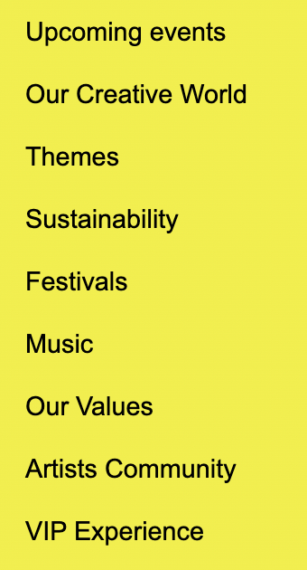

# Procesverslag
Markdown is een simpele manier om HTML te schrijven.  
Markdown cheat cheet: [Hulp bij het schrijven van Markdown](https://github.com/adam-p/markdown-here/wiki/Markdown-Cheatsheet).

Nb. De standaardstructuur en de spartaanse opmaak van de README.md zijn helemaal prima. Het gaat om de inhoud van je procesverslag. Besteedt de tijd voor pracht en praal aan je website.

Nb. Door *open* toe te voegen aan een *details* element kun je deze standaard open zetten. Fijn om dat steeds voor de relevante stuk(ken) te doen.

## Jij

  
uitwerken voor kick-off werkgroep

  ### Auteur:
  Samantha Tjin-A-Lim

  #### Je startniveau:
  Blauw

  #### Je focus:
  Surface plane
 

## Je website

  
uitwerken voor kick-off werkgroep

  ### Je opdracht:
  https://elrow.com/en/events/894/london-11132022

  #### Screenshot(s) van de eerste pagina (small screen): 
  de "home" pagina 
  

  #### Screenshot(s) van de tweede pagina (small screen):
  de "upcoming events" pagina 
  
 

## Toegankelijkheidstest 1/2 (week 1)

  
uitwerken na test in 1e werkgroep

  ### Bevindingen
  Lijst met je bevindingen die in de test naar voren kwamen:
  - hij leest ook "nieuwe regel" voor
  - hij verteld steeds welk tekstelement je bent 
  - hij kan niet de afbeelding uitleggen alleen als er tekst in staat
  - de cookies leest hij ook voor
  - sommige koppen zijn niet samengevoegd

  #### Screenreader
  De website doorlopen met de screenreader ging niet heel soepel. Op de website zijn de afbeelding van de events belangrijk, want daar staat de meeste informatie op. De screenreader kan natuurlijk de afbeeldingen niet voorlezen en hierdoor mist er soms wat informatie. Verder worden sommige koppen niet samengevoegd en zou je eigenlijk niet kunnen weten dat bepaalde getallen bij bepaalde woorden horen.

  #### Muis en Toetsenbord 
  Tijdens het tabben komt er nergens een border omheen. Hierdoor heb je geen idee waar je bent. De website maakt wel gebruik van de pointer hand bij links, maar bij veel links gebeurt er niks anders als je erover hovert of als hij active is. Als je bij de pijltjes hovert word de button een beetje lichter, maar daar zie je bent snel overheen. Als een button active is gebeurt er helemaal niks.

  #### Motoriek (shocks, elastiekjes)
  Door de elastiekjes om mijn vinger kon ik totaal niet door de site heen scrollen. Je vingers zitten zo dicht op elkaar dat je ze bijna niet kan bewegen en dus ook niet naar beneden kan scrollen.

  #### Visueel (brillen, contrast, kleurenblind, dark/light). 
  Met de brillen kijken ging eigenlijk best gemakkelijk. Ik kon met de meeste brillen nog steeds de meeste dingen van mijn website zien. Alleen bij sommige brillen werd de tekst heel wazig waardoor je heel dichtbij het scherm of heel gefoccused moest zijn wilde je nog iets ervan lezen. Verder waren de kleuren soms wel moeilijk te onderscheiden en te zien, aangezien mijn website gebruik maakt van heel veel velle kleuren.

## Breakdownschets (week 1)

  
uitwerken na afloop 2e werkgroep

  ### de hele pagina: 
  
  

  ### dynamisch deel (bijv menu): 
  
  

## Voortgang 1 (week 2)

  
uitwerken voor 1e voortgang

  ### Stand van zaken
  De html ging best gemakkelijk, vooral door middel van de breakdownschets. Met de css heb ik een klein begin gemaakt wat ook wel prima te doen was. Alleen liep ik vast hoe je de verschillende sections van elkaar kan onderscheiden zonder classes te gebruiken.

  

  ### Agenda voor meeting
  samen met je groepje opstellen

  | student 1: Samantha       | student 2: Jaiden  | student 3: Ying| 
  | ---                       | ---                | ---            |             
  | sections onderscheiden    | buttons in header  | verstopte link |
  | carroussel zonder classes |                    | hamburger menu |
  

  ### Verslag van meeting
  hier na afloop snel de uitkomsten van de meeting vastleggen

  - sections -> nth-of-type() gebruiken + tussen haakjes hoeveelste section
  - carroussel -> code van de docent gebruiken dus moet classes
  

## Voortgang 2 (week 3)

  
uitwerken voor 2e voortgang

  ### Stand van zaken
  Deze week ging heel goed. Begin van de week liep ik nog een beetje vast met bijv de onderdelen in mijn article in de goede volgorde krijgen. Hiervoor had ik hulp gevraagd aan Yara de student assistent en het bleek heel simpel te zijn. Verder kreeg ik antwoorden op de vragen die ik op dat moment had waardoor ik tijdens het voortganggesprek geen nieuwe vragen had. Doordat mijn vragen op dat moment waren beantwoord maakte ik in mijn vrije tijd groote stappen.

  

  ### Agenda voor meeting
  samen met je groepje opstellen

  | student 1: Samantha      | student 2: Jaiden              | student 3: Frank       | student 4: Guido |
  | ---                      | ---                            | ---                    | ---              |
  | code controleren         | gedeelte helemaal tot de rand  | tekst opschuiven       | code controleren |
  |                          | footer                         | afbeeldingen met tekst |                  |
  

  ### Verslag van meeting
  hier na afloop snel de uitkomsten van de meeting vastleggen

  - code over het algemeen goed
  - tussen de buttons hoeft geen "type=button" te staan
  - css reset toevoegen

## Toegankelijkheidstest 2/2 (week 4)

  
uitwerken na test in 8e werkgroep

  ### Bevindingen
  - geeft niet aan waar de link heen gaat, maar alleen wat voor tekst er staat
  - kleuren en lettergroote zijn goed te zien

  #### Screenreader
  De screenreader ging over het algemeen heel soepel. Alle kopjes worden duidelijk aangegeven en de meeste linkjes ook. Alleen de linkjes van de "buy tickets" knop en die van de "show all" knop moeten een aria label krijgen zodat het duidelijk word waarvoor je tickets koop en wat je te zien krijgt als je op de "show all" knop drukt.
  
  
  

  #### Muis en Toetsenbord 
  Bij het toetsenbord is het duidelijk door de rand om het element waar hij staat. Bij de navigatie is de tab uit beeld dus dat is een beetje vervelend als je niet weet dat daar de navigatie is. 

  Met de muis is de pointer hand heel handig dat je weet dat daar een link is. 

  Bij allebei moeten wel nog kleuren toegevoegd worden waardoor het tijdens het tabben niet alleen een rand eromheen is en met de muis de hover en active duidelijk te zien is.

  

  #### Motoriek (shocks, elastiekjes)
  Bij deze 2 onderdelen is het nog steeds bijna onmogelijk om goed door de site heen te scrollen.

  #### Visueel (brillen, contrast, kleurenblind, dark/light). 
  Ik heb verschillende brillen gebruikt tijdens het testen en dit kwam er uit:
  - central field loss: alleen kleuren en randen te zien - schuin kijken zie je wel alles
  - peripheral field loss: goed als je focus in rechtvoor je is maar ziet niks aan de zijkant 
  - combined loss: alles is goed te zien - kleine tekst wel iets minder goed te lezen maar nog wel te doen

  

  Voor het kleurencontrast heb ik ook verschillende kleurenblindheid gebruikt:
  - protanopia: kleuren zijn vooral blauw en beetje geel in afbeeldingen - roze is wat lichter blauw/grijs achtig
  - deuteranopia: kleuren veel blauw en grijs en beetje geel in afbeeldingen - paars is blauw en roze is grijs 
  - tritanopia: roze is beetje rood/roze achtig - meer kleur dan de vorige 2 - kleuren minder vel 
  - achromatopsia: alles is grijs - kleuren die normaal donker zijn zijn nog wel donkerder grijs 

  
  
  

## Voortgang 3 (week 4)

  
uitwerken voor 3e voortgang

  ### Stand van zaken
  Ik heb het grootste deel van mijn website al af. Ik hoef alleen nog maar bepaalde dingen goed te krijgen die nu nog niet zo goed werken en de animaties toe te voegen. Verder loop ik wel vast met de css van mijn tweede pagina. Veel moet daarvan hetzelfde zijn als de eerste pagina (header en footer) maar die maakt hij totaal anders. 

  
  
  

  ### Agenda voor meeting
  samen met je groepje opstellen

  | student 1: Samantha | student 2: Jaiden  | student 3: Frank | student 4: Ying    |
  | ---                 | ---                | ---              | ---                |
  | pagina 2 met css    | button             | klikbaar maken   | caroussel          |
  | responsive article  | dit als er tijd is | html tabbaar     | responsive buttons |
  | glans bij button    |                    |                  |                    |

  ### Verslag van meeting
  hier na afloop snel de uitkomsten van de meeting vastleggen

  - pagina 2 css -> meerder css pagina's: algemeen, home pagina en event pagina
  - responsive article -> width moest op 100% 
  - glans bij button -> background-image en linear-gradient 

## Eindgesprek (week 5)

  
uitwerken voor eindgesprek

  ### Je uitkomst - karakteristiek screenshots:
  
  

  ### Dit ging goed/Heb ik geleerd: 
  Ik ben heel erg trots op het eindresultaat. Ik heb veel dingen geleerd zoals hoe je onderdelen kan groeperen zonder gebruik te maken van een div of class. Ook heb ik meer animatie soorten geleerd en heb ik geleerd om dingen te positioneren.

  

  ### Dit was lastig/Is niet gelukt:
  Ik vond de carroussel wel heel lastig. Uiteindelijk heb ik de code van de docent gebruikt, maar die kan ik zelf nog niet helemaal uitleggen en hij werkt jammer genoeg ook niet zoals ik het graag had gewilt. 

  

## Bronnenlijst

  
continu bijhouden terwijl je werkt

  Nb. Wees specifiek ('css-tricks' als bron is bijv. niet specifiek genoeg).

  1. de docent
  2. yara de student assistent 
  3. https://codepen.io/shooft/pen/gOzGoww?editors=1010
  4. https://codepen.io/shooft/pen/yLKWzqy
  5. https://codepen.io/shooft/pen/KKorGPa?editors=0110
  6. https://codepen.io/shooft/pen/oNzGJMM
  7. https://codepen.io/shooft/pen/yLKWzqy
  8. https://codepen.io/shooft/pen/GRxXboQ
  9. https://codepen.io/shooft/pen/KKorGPa
  10. https://codepen.io/shooft/pen/qBogPoM?editors=1010

